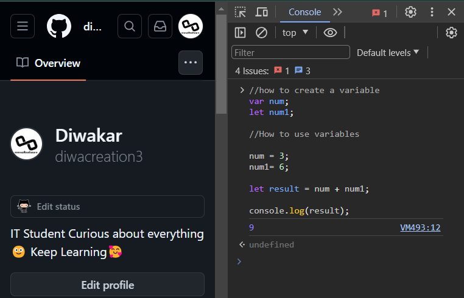

## Javascript Syntax

```js
//how to create a variable
var num;
let num1;

//How to use variables

num = 3;
num1= 6;

let result = num + num1;

console.log(result);
```
Output



### Javascript Values
The javascript syntax defines two types of values:

- Fixed Values
- Variable values

Fixed values are called Literals.

variable values are called Variables.

### Javascript Literals

The two most important syntax rules for fixed values are:

1. Numbers are written with or without decimals:
```js
9.63
1001
```
2. Strings are text, written within double or single quotes:

```js
"Buddha"
'Buddha'
```

## Javascript variables
In a programming language, variables are used to store data values.

javascript uses the keyword var, let and const to declare variables.

An equal sign is used to assign to variables.

Example using var

```js
var num = 3;
var num1 = 6;
var result = num + num1;
```
> Note  
> The var keyword was used in all javascript code from 1995 to 2015

> Let and const keyword was added to javascript in 2015.

Example using let
```js
let num = 3;
let num1 = 6;
let result = num + num1;
```
Example using const 

```js
const num = 6;
const num = 3;
const result = num + num1;
```

Mixed example
```js
const price = 3;
const price1 = 6;
let total = price + price1;
```

The two variable price and price1 are declared with the const keyword.
These constant values and cannot be changed.
The Variable total is declared with the let keyword. The value total can be changed.

## Javascript Identifiers
All javascript must be indentified with unique names.

These unique names are called identifiers. identifiers can be shorted names ( like num and num1) or more desprictive names(age, sum, totalVolume)

The general rules for constructing names for variables (unique identifiers) are:

- Names can contain letters, digits, underscores, and dollar signs.
- Names must begin with a letter.
- Names can also begin with $ and _ (but we will not use it in this tutorial).
- Names are case sensitive (y and Y are different variables).
- Reserved words (like JavaScript keywords) cannot be used as names.

## The assignment Operator
In javascript the eual sign = is an assignment operator to an equal to operator. This is different from algebra. The following does not make sense in algebra.
```js
num = num + 3;
```
