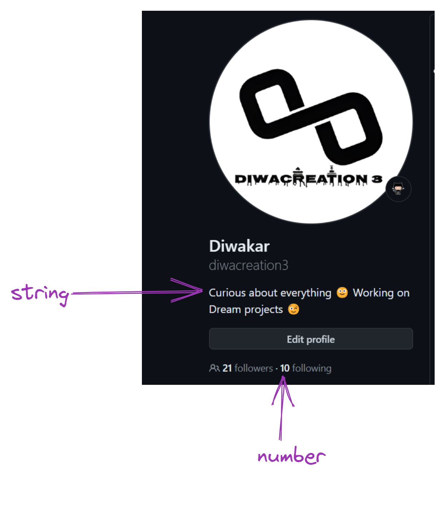

# Javascript Data types
Javascript has 8 Datatypes

1. String
1. Number
1. Bigint
1. Boolean
1. Undefined
1. Null
1. Symbol
1. Object

### The Object Datatype
1. An object
1. An array
3. A date



Examples
```js
// Numbers
let length = 33;
let weight = 63.9;
console.log("length = " +length, "weight= " + weight)

// Strings
let color = "Blue";
let lastName = "Phuyal ";
console.log("color= " + color, "lastName= " + lastName);

// Booleans
let num = true;
let num1 = false;
console.log("num= " + num , "num1= " + num1);

//Object
const person = {firstName: "Shreeshma", lastname: "phuyal"};
console.log("object: " + person);

//Array object
const foods = ["Momo", "chatpatey", "panipuri"];
console.log("Array: " + foods);

//Date object
const date = new Date("2080-10-04");
console.log("Date: " + date)
```


### Javascript Types for Dynamic
Javascript has dynamic types. This means that the same variable can be used to hold  different data types:

```js
let num; //now num is undefined
num = 6; // Now num is number
num = "buddha" // now num is a string 
```

